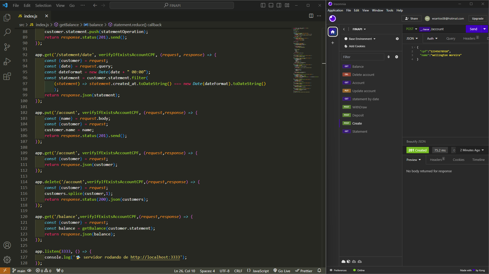

# Projeto de API Bancária 🏦



Este projeto é uma API RESTful simples que simula operações bancárias como criação de contas, depósitos, saques, consulta de saldo e extratos bancários. Desenvolvido com o framework Express.js, permite gerenciar clientes e suas transações de forma eficiente e prática.

## Funcionalidades

A API oferece as seguintes rotas e funcionalidades:

1. **Criação de Conta (`POST /account`)**: Cria uma nova conta bancária usando CPF e nome.
2. **Consulta de Extrato Completo (`GET /statement`)**: Retorna o extrato completo do cliente autenticado.
3. **Depósito (`POST /deposit`)**: Adiciona uma transação de crédito ao extrato do cliente.
4. **Saque (`POST /withdraw`)**: Realiza uma transação de débito, se houver saldo suficiente.
5. **Extrato por Data (`GET /statement/date`)**: Retorna o extrato filtrado por uma data específica.
6. **Atualização de Conta (`PUT /account`)**: Permite atualizar o nome do cliente.
7. **Consulta de Conta (`GET /account`)**: Retorna informações da conta do cliente.
8. **Exclusão de Conta (`DELETE /account`)**: Exclui a conta do cliente autenticado.
9. **Consulta de Saldo (`GET /balance`)**: Retorna o saldo atual do cliente.

## Middleware

- **Verificação de Conta (`verifyIfExistsAccountCPF`)**: Middleware que verifica se o cliente com o CPF fornecido existe. Utilizado em várias rotas para garantir a segurança e consistência das operações.

## Tecnologias Utilizadas

- **Node.js** com **Express.js**: Para criação do servidor e gerenciamento das rotas.
- **UUID**: Geração de identificadores únicos para cada conta.

## Como Executar o Projeto

1. Clone o repositório.
2. Instale as dependências:
   ```bash
   npm install
   ```
3. Inicie o servidor:
   ```bash
   npm start
   ```
4. O servidor estará disponível em `http://localhost:3333`.

## Exemplo de Requisição

Para criar uma nova conta, envie uma requisição `POST` para `/account` com o seguinte payload:
```json
{
  "cpf": "12345678900",
  "name": "Nome do Cliente"
}
```

### Observação

Para acessar as rotas protegidas pelo middleware, inclua o CPF no cabeçalho da requisição:
```json
{
  "cpf": "12345678900"
}
```

## Contribuição

Contribuições são bem-vindas! Sinta-se à vontade para abrir uma _issue_ ou _pull request_.

---

Esse é um projeto de exemplo desenvolvido para estudo de APIs com Node.js e Express.
