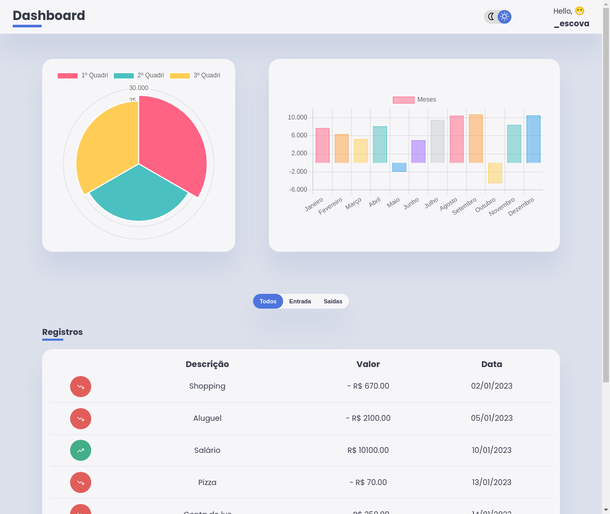

# Dashboard Financeiro - Gráficos Dinâmicos com Chart.js

Este projeto é um **dashboard financeiro** que exibe registros de entradas e saídas financeiras através de **gráficos dinâmicos** e uma tabela interativa. O objetivo é fornecer uma interface intuitiva para visualizar dados financeiros ao longo de meses e quadrimestres, com a capacidade de alternar entre **tema claro** e **tema escuro**.

    

## Funcionalidades
- **Gráfico de Barras**: Exibe a diferença entre entradas e saídas financeiras por mês.
- **Gráfico Polar**: Agrupa os dados para mostrar o comportamento financeiro de cada quadrimestre.
- **Tabela de Registros**: Mostra detalhes sobre cada transação (entrada/saída), incluindo a descrição, valor e data.
- **Filtro de Transações**: Botões que permitem filtrar entre **todas as transações**, **entradas** ou **saídas**.
- **Alternância de Tema**: Permite alternar entre tema claro e escuro, ajustando automaticamente o estilo dos gráficos.

## Tecnologias Utilizadas
- **HTML**: Estrutura da interface do usuário.
- **CSS**: Estilização da página, com suporte a temas claro e escuro.
- **JavaScript (ES6+)**: Manipulação dos dados, criação e estilização dinâmica dos gráficos com a biblioteca `Chart.js`.
- **Chart.js**: Biblioteca para criação de gráficos dinâmicos.
  
## Como Funciona
1. O projeto obtém dados financeiros a partir de um arquivo `data.json`.
2. Esses dados são manipulados para calcular as diferenças entre entradas e saídas e são exibidos nos gráficos e na tabela.
3. A interface permite que o usuário alterne entre temas claro e escuro, e os gráficos são automaticamente destruidos e recriados para se adequar ao tema ativo.
