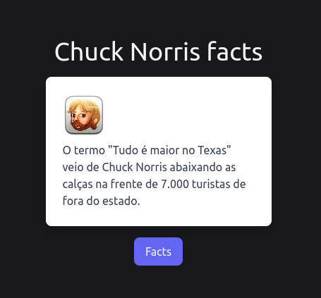

# Chuck Norris Facts API

<p align='center'>

</p>

Este é um projeto simples desenvolvido com FastAPI que exibe fatos aleatórios do Chuck Norris, traduzidos para o português usando a biblioteca `translate`. Ele utiliza o `htmx` para fazer requisições assíncronas e `tailwindcss` para o estilo da interface.

## Funcionalidades

- Exibe fatos aleatórios do Chuck Norris obtidos da [Chuck Norris API](https://api.chucknorris.io/).
- Traduz automaticamente os fatos para o português.
- Interface atualizada dinamicamente com `htmx` sem recarregar a página.
- Layout estilizado com `tailwindcss`.

## Requisitos

- Python 3.9+

## Instalação

1. Clone o repositório para o seu ambiente local.

2. Navegue até o diretório do projeto.

3. Crie e ative um ambiente virtual:

    ```bash
    python -m venv venv
    source venv/bin/activate  # Linux/macOS
    venv\Scripts\activate  # Windows
    ```

4. Instale as dependências necessárias:

    ```bash
    pip install -r requirements.txt
    ```

5. Execute o servidor FastAPI:

    ```bash
    uvicorn main:app --reload
    ```

6. Abra o navegador e acesse `http://127.0.0.1:8000/` para visualizar a aplicação.

## Estrutura do Projeto

```bash
├── main.py               # Arquivo principal com as rotas da API
├── templates/            # Diretório contendo os arquivos HTML (Jinja2)
│   ├── base.html         # Template base com estrutura HTML comum
│   ├── content.html      # Conteúdo dinâmico para exibir os fatos
│   └── index.html        # Página principal com o botão e integração com HTMX
└── README.md             # Este arquivo README
```

### Descrição dos arquivos

- **main.py**: Este arquivo define duas rotas principais. A rota `/` serve a página inicial, e a rota `/api/chuckfacts` obtém fatos aleatórios do Chuck Norris, traduzindo-os para o português e os renderizando dinamicamente na página.
  
- **templates/base.html**: Template base que define a estrutura HTML básica e carrega `htmx` e `tailwindcss` via CDN.

- **templates/content.html**: Estrutura HTML usada para exibir o fato do Chuck Norris e o ícone de Chuck Norris retornado pela API.

- **templates/index.html**: Página inicial onde um botão aciona o carregamento dinâmico de novos fatos via `htmx`.

## Como Funciona

1. Quando a aplicação é iniciada, a página inicial (`/`) é renderizada com um botão e uma imagem de Chuck Norris.
2. Ao clicar no botão **Facts**, o `htmx` faz uma requisição assíncrona para a rota `/api/chuckfacts`, que:
   - Faz uma chamada à API de piadas de Chuck Norris.
   - Traduz a piada para o português.
   - Renderiza o conteúdo traduzido na página principal, substituindo o conteúdo anterior.
   
## Tecnologias Utilizadas

- **FastAPI**: Framework web rápido para construção de APIs com Python.
- **Requests**: Para realizar requisições HTTP para a Chuck Norris API.
- **Translate**: Para tradução automática do inglês para o português.
- **Jinja2**: Sistema de templates para renderizar conteúdo dinâmico.
- **HTMX**: Para manipulação de requisições assíncronas no lado do cliente sem precisar recarregar a página.
- **TailwindCSS**: Para estilização da interface, facilitando a criação de layouts responsivos e modernos.
