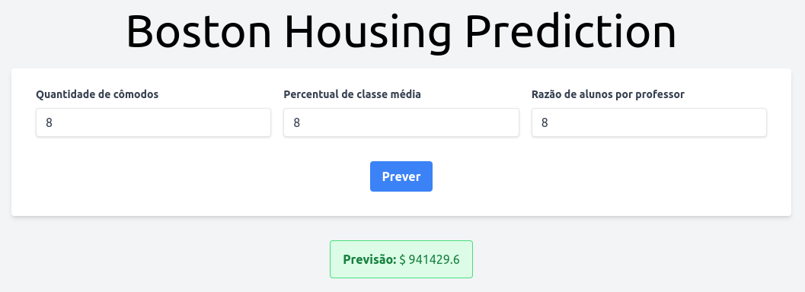

Esta é uma aplicação web de previsão de preços de moradias, utilizando **FastAPI** e um modelo de **Regressão Linear** treinado com o conjunto de dados de Boston Housing. A aplicação permite que os usuários façam previsões com base em três entradas: o número de cômodos, o percentual de classe social baixa e a proporção de alunos por professor. O resultado é exibido de forma dinâmica na página utilizando **htmx** para melhorar a experiência do usuário.

## Tecnologias Utilizadas

- **FastAPI**: Framework para criação de APIs rápidas e assíncronas.
- **Scikit-learn**: Biblioteca para aprendizado de máquina, utilizada para treinar o modelo de regressão linear.
- **Jinja2**: Motor de templates para renderização do front-end.
- **htmx**: Biblioteca de JavaScript que facilita requisições AJAX para criar experiências dinâmicas sem a necessidade de recarregar a página.
- **HTML + TailwindCSS**: Para estruturação e estilização do front-end.

## Funcionalidades

- Formulário de previsão com 3 campos de entrada:
  - Quantidade de cômodos.
  - Percentual de classe social baixa.
  - Proporção de alunos por professor.
- Previsão dinâmica exibida na página sem recarregar, utilizando **htmx**.
- Validação básica de inputs para evitar erros no envio de dados inválidos.

## Sobre o modelo treinado
Este modelo de regressão foi treinado com base no dataset `Boston housing`. O objetivo principal foi identificar o modelo de regressão que melhor prediz o valor médio dos imóveis, com base em métricas como o coeficiente de determinação R², MAE (erro absoluto médio), MSE (erro quadrático médio), e RMSE (raiz do erro quadrático médio).

**Métricas do modelo**

```
R² (Treino): 91.60%
R² (Teste): 84.65%
MAE: 49,730.29
MSE: 4,452,803,054.51
RMSE: 66,729.32
```
    
>Você pode conferir o repositório com o projeto completo onde vários modelos foram treinados e suas métricas avaliadas em [Boston housing prediction](https://github.com/esscova/data-science/blob/main/regression/boston_housing)

## Requisitos

- Python 3.7+
- Scikit-learn
- FastAPI
- htmx

## Instalação

1. **Clone o repositório**

2. **Crie e ative um ambiente virtual:**

   ```bash
   python -m venv .venv
   source .venv/bin/activate  # No Windows use: .venv\Scripts\activate
   ```

3. **Instale as dependências:**

   ```bash
   pip install -r requirements.txt
   ```

4. **Execute a aplicação:**

   ```bash
   uvicorn main:app --reload
   ```

5. **Acesse a aplicação:**

   Abra seu navegador e acesse `http://127.0.0.1:8000`.

## Estrutura do Projeto

```plaintext
├── main.py               # Arquivo principal com a aplicação FastAPI
├── routes.py             # Define as rotas para requisições GET e POST
├── models
│   └── regressor.pkl      # Arquivo com o modelo de regressão linear treinado
├── templates
│   ├── base.html          # Template base do Jinja2
│   ├── index.html         # Página inicial com o formulário
│   └── form.html          # Componente de formulário
└── README.md              # Documentação do projeto
```

## Exemplo de Previsão

Na página inicial, insira os valores para:

- **Quantidade de cômodos** (ex: 8).
- **Percentual de classe baixa** (ex: 12).
- **Proporção de alunos x professor** (ex: 18).

Após submeter o formulário, a previsão será exibida diretamente na página.

## Contribuição

Contribuições são bem-vindas! Sinta-se à vontade para abrir uma *issue* ou enviar um *pull request*.

## Contato

Caso tenha alguma dúvida ou sugestão, entre em contato:

- **Email**: wsantos08@hotmail.com
- **LinkedIn**: [wellington-moreira-santos](https://www.linkedin.com/in/wellington-moreira-santos/)
