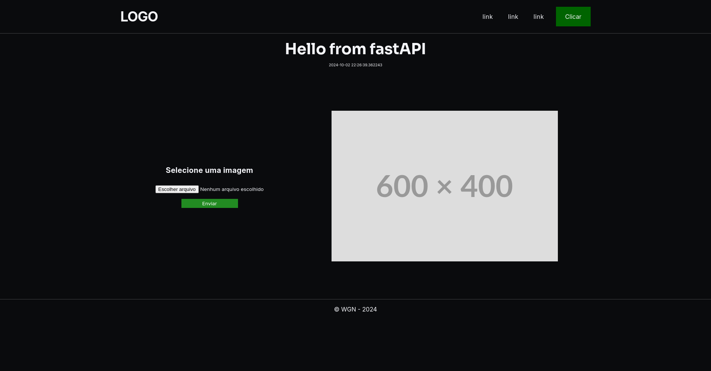

# Aplicação web com FastAPI


## Descrição
Neste projeto aprendemos como utilizar o FastAPI para renderizar templates HTML criando uma simples aplicação web, onde através de um formulário é possível enviar arquivos que, serão renomeados e salvos em um diretório da aplicação.

Usar FastAPI com Jinja2 oferece diversas utilidades que melhoram o desenvolvimento de aplicações web, como: integração de templates, organização e flexibilidade.

A combinação de FastAPI e Jinja2 uma escolha poderosa para o desenvolvimento de aplicações web modernas e eficientes.

## Estrutura do projeto
```
.
├── main.py
├── media
├── README.md
├── requirements.txt
├── screenshot.png
├── static
│   └── css
│       ├── main.css
│       └── reset.css
└── templates
    ├── _base.html
    ├── form.html
    └── index.html
```

## Tecnologias utilizadas
- FastAPI
- Jinja2
- Uvicorn
- HTML e CSS

## Instalação
1. Clone o respositório

2. Instale as dependências do projeto
```bash
pip install -r requirements.txt
```
## Uso
Inicie o servidor
```bash
python main.py
```
O servidor FastAPI estará disponível em http://localhost:8000.

## Endpoints
- `GET  /` : Página Home.
- `POST /servicos` : Envio de arquivo.


