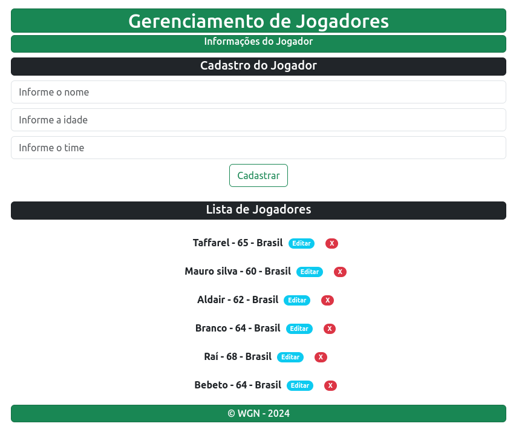

# **Gerenciador de Jogadores**
<p align='center'>
    
</p>

## Descrição
Este projeto é um gerenciador de jogadores, permitindo o cadastro, edição, listagem e exclusão de jogadores. Utiliza FastAPI para o backend e MongoDB como banco de dados, enquanto o frontend é construído com React.

## Tecnologias Usadas
- **Backend**:
  - FastAPI
  - MongoDB (com PyMongo)
  - Uvicorn
- **Frontend**:
  - React
  - Vite
  - Axios
  - Bootstrap
- **Outras**:
  - Docker

## Instalação

### Pré-requisitos
- [Docker](https://www.docker.com/get-started) instalado na sua máquina.

### Rodando com Docker
1. Clone o repositório:
   ```bash
   git clone https://github.com/esscova/web.git
   cd web/fullstack/farm
   ```
2. Crie e inicie os containers:
   ```bash
   docker-compose up --build
   ```

## Uso
- O servidor FastAPI estará disponível em `http://localhost:8000`.
- O frontend React estará acessível em `http://localhost:5173`.
- O mongo-express estará disponível em `http://localhost:8081`.

### Endpoints
Você pode adicionar uma seção com exemplos de endpoints, como:
- `POST /jogadores`: Cadastrar um jogador.
- `GET /jogadores`: Listar todos os jogadores.
- `PUT /jogadores/{id}`: Editar um jogador.
- `DELETE /jogadores/{id}`: Excluir um jogador.

## Estrutura do Projeto
```
/farm
├── backend
│   ├── core
│   │   └── database.py
│   ├── Dockerfile
│   ├── main.py
│   ├── requirements.txt
│   └── ...
└── frontend
    ├── src
    │   └── App.jsx
    ├── index.html
    ├── package.json
    └── ...
```


